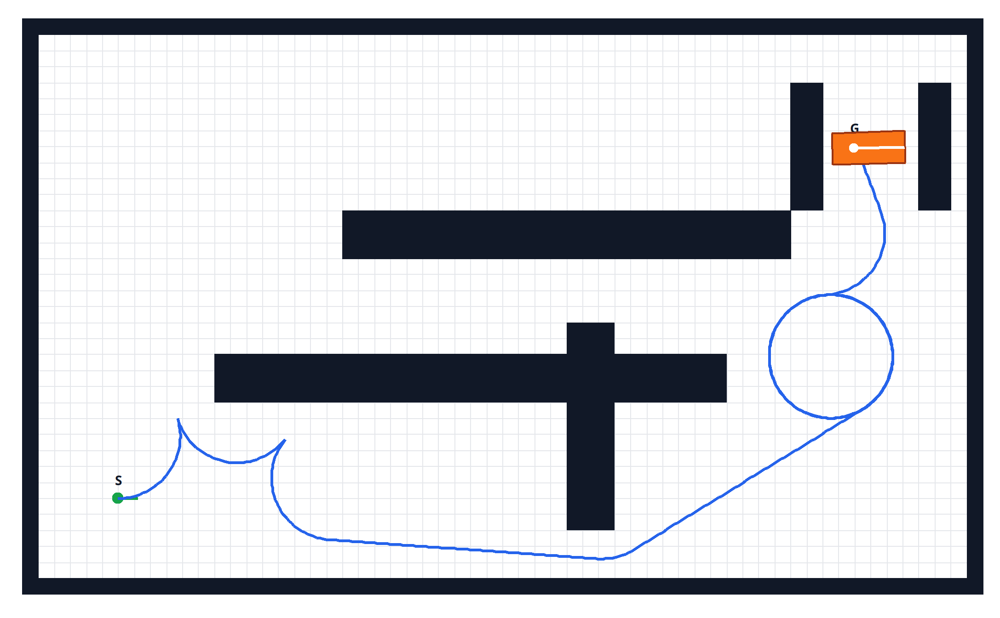

# Hybrid A* 路径规划系统设计与实现报告

## 摘要

本项目实现了一个面向车辆路径规划教学展示的 Hybrid A* 路径规划程序。程序以栅格地图、起点、终点和车辆参数为输入，使用带车辆运动学约束的 Hybrid A* 算法搜索从起点到终点的连续可行路径，并将规划结果导出为 JSON。项目使用 C++23 编写核心规划逻辑，并提供独立的 FLTK 路径 JSON 查看工具，便于课堂演示、结果复现和批量实验分析。

---

## 1. 问题分析

### 1.1 问题来源

路径规划是机器人、自动驾驶、智能仓储和无人系统中的基础问题。传统栅格 A* 算法通常把机器人看作可以在栅格之间自由移动的点，这种模型适合二维平面上的点机器人或移动方向限制较少的机器人。但是汽车类车辆具有明显的非完整约束：车辆不能横向平移，不能原地旋转，转弯半径有限，并且前进和倒车的代价也可能不同。因此，如果直接使用普通 A* 规划车辆路径，得到的路径往往不能被真实车辆执行。

本项目解决的问题是：在带障碍物的二维地图中，为一个具有长度、宽度、轴距和最大转向角约束的车辆，规划一条从指定起点位姿到指定终点位姿的无碰撞路径。这里的“位姿”不仅包括位置 \((x, y)\)，还包括车辆朝向 \(\theta\)。

### 1.2 问题意义

车辆路径规划需要同时考虑可达性、安全性和运动学可行性。相比普通 A*，Hybrid A* 能在连续状态空间中保留车辆的真实位姿，并在搜索时使用车辆运动模型生成后继节点，因此规划出的轨迹更接近真实车辆可以执行的轨迹。该方法常用于自动泊车、低速无人车导航、仓库搬运车路径规划等场景。

本项目虽然是课程大作业规模的演示系统，但实现了一个完整闭环：地图编辑、配置读取、路径规划、碰撞检测、实验记录和可视化展示。通过该系统可以直观理解“点机器人路径规划”和“车辆运动学路径规划”的差异。

### 1.3 解决方法

项目采用 Hybrid A* 作为核心搜索算法。其基本思想是：

1. 搜索状态使用连续车辆位姿 \((x, y, \theta)\)，而不是只使用栅格坐标。
2. 每次节点扩展不直接移动到相邻栅格，而是使用简化自行车模型模拟车辆沿一段运动基元前进或倒车。
3. 使用离散化的 \((x, y, \theta)\) 索引维护 closed set，避免无限重复搜索。
4. 使用代价函数评价路径质量，代价包括路径长度、倒车惩罚、转向惩罚、换挡惩罚和转向变化惩罚。
5. 使用启发函数引导搜索方向。当前程序支持欧几里得启发式和组合启发式，组合启发式将无障碍 Reeds-Shepp 风格距离与考虑障碍物的启发式结合。
6. 接近目标时尝试 Reeds-Shepp 解析扩展，以加快收敛并改善终点连接质量。

车辆运动模型采用简化 bicycle model。车辆状态点定义为后轴中心，前轮转角决定曲率：

\[
\kappa = \frac{\tan(\delta)}{L}
\]

其中 \(\delta\) 为前轮转向角，\(L\) 为轴距。每个小步的状态更新为：

\[
x_{next} = x + d \cdot s \cdot \cos\theta
\]

\[
y_{next} = y + d \cdot s \cdot \sin\theta
\]

\[
\theta_{next} = \theta + d \cdot s \cdot \kappa
\]

其中 \(d = 1\) 表示前进，\(d = -1\) 表示倒车，\(s\) 表示积分步长。

---

## 2. 设计方案

### 2.1 总体路线

本项目的总体路线是构建一个从地图输入到路径输出再到动画展示的最小闭环：

```text
Web 地图编辑器
    ↓ 导出 JSON 地图
C++ 读取地图与 YAML 配置
    ↓ 构造 GridMap / Car / HybridAstar
Hybrid A* 搜索车辆可行路径
    ↓ 碰撞检测与目标判断
输出 result.json / 实验 CSV / 对比报告
    ↓
独立路径 JSON 查看器展示规划结果
```

项目的输入主要包括：

- 地图 JSON 文件：描述地图尺寸、障碍物、起点和终点。
- YAML 配置文件：描述地图路径、车辆参数和 Hybrid A* 参数。

项目的输出主要包括：

- `output/result.json`：包含地图、车辆、路径和扩展节点数据。
- `output/single_run_timing.csv`：记录单次运行的成功状态、路径点数、扩展节点数、运行时间和细分计时指标。
- `output/*_report.md`：记录批量实验的汇总结果和启发式对比结论。

### 2.2 程序结构

项目主要目录如下：

```text
final/
├── CMakeLists.txt
├── config/default.yaml
├── include/
├── src/
├── map/
├── output/
├── tests/
├── tool/
└── third_party/
```

其中：

- `include/` 存放头文件和主要类定义。
- `src/` 存放 C++ 实现文件。
- `map/` 存放地图编辑器和地图 JSON 文件。
- `config/` 存放程序运行配置。
- `tests/` 存放自动测试程序。
- `third_party/` 存放第三方依赖，包括 FLTK 和 Reeds-Shepp 相关代码。
- `output/` 存放程序运行后生成的可视化和实验结果。

### 2.3 Hybrid A* 算法原理

Hybrid A* 可以看成“普通 A* 在车辆运动学约束下的扩展版本”。普通 A* 通常把状态定义为二维栅格点，扩展方式是上下左右或八邻域移动；而 Hybrid A* 的状态必须包含车辆朝向，因此搜索空间变成 \((x, y, \theta)\)。这意味着算法不仅要回答“车能不能到某个位置”，还要回答“车能不能以合适的姿态到达该位置”。

#### 2.3.1 状态表示

在本项目中，一个搜索节点对应车辆的一个连续位姿，即后轴中心位置 \((x, y)\) 与朝向角 \(\theta\)。这样做的优点是能够直接反映车辆的真实朝向，使搜索过程天然满足“不能横移、不能原地旋转”的非完整约束。

但是如果完全使用连续状态，搜索会产生无限多个节点。因此 Hybrid A* 通常采用“连续状态搜索，离散索引去重”的思路：节点本身保存连续位姿，而 closed set 使用离散化后的 \((x, y, \theta)\) 索引判断某个状态格是否已经访问过。这样既保留了轨迹的连续性，又能控制搜索规模。

#### 2.3.2 节点扩展

普通 A* 的相邻节点由固定网格邻接关系给出，而 Hybrid A* 的相邻节点由车辆运动学模型生成。本项目采用简化自行车模型，并枚举有限个控制输入，例如左转、直行、右转以及前进/倒车两种行驶方向。对每个控制输入，算法并不是一步跳到某个格点，而是沿该控制量做短距离积分，形成一段运动基元。

这样生成的后继节点具有两个重要特点：

1. 每个节点之间的连接本身就是一段车辆可执行轨迹。
2. 节点扩展已经显式包含了转弯半径、前进倒车和朝向变化等车辆约束。

因此，Hybrid A* 得到的结果不再是“折线式的网格路径”，而是由许多短运动基元拼接而成的连续路径。

#### 2.3.3 代价函数

Hybrid A* 仍然保持 A* 的评价框架，即用

\[
f(n) = g(n) + h(n)
\]

选择当前最有希望扩展的节点。其中 \(g(n)\) 是从起点到当前节点的累计代价，\(h(n)\) 是当前节点到目标的启发式估计。

与普通 A* 不同，车辆路径规划中的 \(g(n)\) 不仅仅是几何长度，通常还要加入驾驶行为相关的惩罚项。本项目将以下因素纳入路径代价：

- 路径长度代价：鼓励更短路径。
- 倒车惩罚：避免无必要的长距离倒车。
- 转向惩罚：抑制频繁大角度转向。
- 换挡惩罚：减少前进和倒车反复切换。
- 转向变化惩罚：使路径更平滑，减少方向盘急剧变化。

这样的代价设计反映了一个重要事实：车辆路径规划不只是“能到就行”，还要尽量让轨迹更自然、更稳定、更接近真实驾驶行为。

#### 2.3.4 启发式搜索

如果没有启发式，Hybrid A* 在三维状态空间中的搜索代价会很高，因此启发函数非常关键。本项目采用组合启发式思想，用两类信息共同指导搜索：

1. 不考虑障碍物时的车辆可达代价估计。
2. 考虑障碍物分布后的环境代价估计。

前者主要反映车辆运动学限制。例如即使目标点很近，如果当前朝向与目标朝向差别很大，真实可行路径也可能并不短。后者则反映地图结构，例如障碍物、窄通道和绕行关系。将两类信息结合起来，可以同时避免“只看直线距离导致忽略车辆姿态”和“只看障碍物导致忽略转弯半径”这两类问题。

#### 2.3.5 碰撞检测

Hybrid A* 的每个节点都对应一个真实车辆位姿，因此不能像点机器人那样只检查中心点是否落在空白栅格内。本项目将车辆近似为一个矩形 footprint，并在运动基元积分过程中对若干采样位姿逐点做碰撞检测。

只有当整段运动基元都不与障碍物相交时，该后继节点才会被接受。这样可以保证搜索得到的路径不仅在离散状态上连通，而且在连续运动过程中也不会穿过障碍物。

#### 2.3.6 解析扩展

Hybrid A* 的一个常见难点是：搜索已经接近目标，但由于姿态约束，最后几步仍然很难恰好进入目标容差范围。为了解决这个问题，很多实现会在接近目标时尝试“解析扩展”。其思想是：不再继续盲目做离散搜索，而是直接构造一条从当前位姿到目标位姿的连续可行曲线，如果该曲线无碰撞，就直接结束搜索。

本项目使用 Reeds-Shepp 风格路径做这种末端连接。Reeds-Shepp 曲线允许车辆前进和倒车，适合描述低速车辆在平面中的短程机动。这样做的意义在于：

- 可以减少末端区域的无效扩展。
- 更容易满足终点姿态要求。
- 能够提升搜索收敛速度和最终路径质量。

#### 2.3.7 本项目中的算法流程

综合来看，本项目中的 Hybrid A* 搜索流程可以概括为：

1. 读取地图、车辆参数和规划参数，构造起点与目标位姿。
2. 初始化 open set、closed set 和启发式模块。
3. 从 open set 取出当前 \(f\) 值最小的节点。
4. 判断是否到达目标，或是否满足解析扩展条件。
5. 枚举有限个转向和前进/倒车控制，生成运动基元。
6. 对运动基元进行边界检查与碰撞检测。
7. 计算子节点的累计代价与启发值，更新 open set。
8. 当成功连接目标时回溯父节点，得到完整路径。

这个流程说明，Hybrid A* 本质上仍然属于启发式图搜索，但它把“图的边”从简单的网格移动替换成了“车辆运动学可执行的短轨迹”，因此更适合用于汽车类系统的路径规划。

### 2.4 核心模块设计

各模块关系如下：

```text
AppConfigLoader
    ├── 读取 map_path
    ├── 生成 VehicleConfig
    └── 生成 HybridAstarConfig

MapLoader ──> GridMap
VehicleConfig ──> Car
GridMap + Car + HybridAstarConfig ──> HybridAstar
HybridAstar ──> Heuristic
HybridAstar ──> VehicleCollisionChecker
HybridAstar ──> ReedsSheppGenerator
HybridAstar ──> PlanResult
PlanResult + GridMap + Car ──> JsonExporter ──> result.json
result.json ──> path_json_viewer / view_path_json.sh ──> FltkViewer
PlanResult + Config ──> ExperimentLogger ──> single_run_timing.csv
```

这种设计将地图、车辆模型、搜索算法、碰撞检测、启发函数和可视化输出分离开来，使各模块职责清晰，便于调试和替换。

从模块职责上看，可以概括为以下几类：

- 地图与配置模块：负责读取 JSON 地图和 YAML 参数，为规划器提供统一输入。
- 车辆与碰撞检测模块：负责描述车辆几何尺寸、运动学约束以及路径是否与障碍物冲突。
- Hybrid A* 搜索模块：负责状态扩展、代价累计、启发式调用、目标判断和路径回溯。
- Reeds-Shepp 与启发式模块：负责无障碍车辆距离估计、末端解析连接和搜索引导。
- 输出与可视化模块：负责导出路径 JSON、记录实验 CSV，并通过独立查看器展示规划结果。

这样的结构强调“算法逻辑”和“工程支撑”的分层：核心搜索模块只关注如何找到路径，而地图读取、结果导出和可视化等功能作为外围模块配合工作。这种分层方式有利于后续替换启发式、调整碰撞检测策略，或将可视化界面替换成其他实现。

---

## 3. 创新性

本项目的创新性主要体现在以下几个方面。

### 3.1 从普通路径规划扩展到车辆运动学路径规划

课程中常见的路径规划示例多以点机器人或简单栅格搜索为主。本项目没有停留在普通 A* 的二维网格移动，而是引入了车辆位姿 \((x, y, \theta)\) 和自行车运动学模型，使规划路径满足车辆不能横移、不能原地旋转、转弯半径有限等约束。

### 3.2 完整实现“输入—规划—输出—查看”闭环

项目不仅实现了算法本身，还实现了地图编辑、JSON 地图读取、YAML 参数配置、路径导出、独立查看器展示和 CSV 实验记录。这样的闭环设计使程序不仅能“算出路径”，还能够方便地展示、复现和比较实验结果。

### 3.3 组合启发式提高搜索指导性

程序提供了组合启发式：

```text
h = max(h_non_obs, h_obs)
```

其中一部分考虑车辆无障碍距离，另一部分考虑障碍物环境信息。这比单纯欧几里得距离更贴近车辆路径规划问题，可以减少盲目扩展，提高搜索质量。

为了验证这一设计不是停留在思路层面，项目还专门做了“本地实验：障碍物启发式对比”，在自动生成的多张地图上比较 `visibility_graph` 和 `reverse_dijkstra` 两种障碍物启发式的实际表现。实验结果表明，在当前实现和参数设置下，`visibility_graph` 在成功率、平均运行时间和平均扩展节点数上整体更优，因此项目不仅提出了组合启发式方案，也通过批量实验对默认障碍物启发式的选取给出了数据支撑。

### 3.4 解析扩展与搜索结合

在接近目标时，程序尝试使用 Reeds-Shepp 风格路径直接连接目标。这种方法把离散搜索和连续解析曲线结合起来，可以减少末端搜索困难，使车辆更容易满足终点位姿约束。

### 3.5 独立路径 JSON 查看工具

项目提供独立的 `tool/path_json_viewer.cpp` 和 `tool/view_path_json.sh`，支持快速打开已导出的路径 JSON 文件。支持单文件打开和目录下所有 JSON 批量打开，批量模式下按文件名排序逐个展示。查看器默认只加载最终路径，跳过大量扩展节点数据，保证大规模实验输出也能快速打开。

---

## 4. 运行方法和参数设置

### 4.1 构建方法

推荐使用项目脚本：

```bash
./run.sh
```

该脚本会自动配置 CMake、构建程序并运行默认配置。

也可以手动构建：

```bash
cmake -S . -B build -DCMAKE_BUILD_TYPE=Release
cmake --build build --config Release
```

### 4.2 运行默认配置

默认配置文件为：

```text
config/default.yaml
```

运行命令：

```bash
./build/hybrid_astar config/default.yaml
```

运行后生成：

```text
output/result.json
output/single_run_timing.csv
```

主程序本身不再内嵌图形界面，而是始终输出 JSON 结果。需要查看路径动画时，可以再使用 `tool/view_path_json.sh output/result.json` 调用独立 FLTK 查看器。

### 4.3 指定其他配置

可以复制 `config/default.yaml`，修改后作为新的配置文件，例如：

```bash
./build/hybrid_astar config/my_test.yaml
```

### 4.4 主要参数说明

配置文件主要分为三部分：地图路径、车辆参数和规划器参数。

#### 4.4.1 地图路径

```yaml
map_path: map/default_map.json
```

该参数指定程序读取哪个地图文件。更换地图会改变障碍物分布、起点和终点，从而影响路径是否可达、路径长度和搜索耗时。

#### 4.4.2 车辆参数

```yaml
vehicle:
  length: 4.5
  width: 2.0
  wheelbase: 2.7
  rear_to_center: 1.35
  max_steer: 0.61
```

- `length` 和 `width` 越大，车辆占用空间越大，碰撞检测越严格，窄通道更难通过。
- `wheelbase` 越大，车辆最小转弯半径通常越大，转弯能力下降。
- `max_steer` 越大，车辆可以更急地转弯；越小则路径更平缓，但更难在狭窄环境中到达目标。
- `rear_to_center` 主要影响车身矩形相对后轴中心的位置，用于碰撞检测和可视化。

#### 4.4.3 Hybrid A* 参数

```yaml
hybrid_astar:
  xy_resolution: 1.0
  theta_bins: 360
  step_size: 0.2
  primitive_length: 1.2
  goal_xy_tolerance: 0.2
  goal_theta_tolerance: 0.05
  reverse_penalty: 2.0
  steer_penalty: 1.0
  gear_switch_penalty: 1.0
  steer_change_penalty: 1.0
  max_iterations: 120000
  allow_reverse: true
  enable_analytic_expansion: true
  analytic_expansion_distance: 8
  analytic_expansion_interval: 25
  collision_safety_margin: 0.0
  enable_obstacle_heuristic: true
  debug: true
  debug_progress_interval: 500
```

主要影响如下：

- `xy_resolution`：越小，位置去重越精细，可能得到更精确路径，但搜索节点更多、速度更慢。
- `theta_bins`：越大，航向角离散越细，终点朝向更容易精确匹配，但状态空间增大。
- `step_size`：越小，运动学积分越细，碰撞检测更准确，但计算量更大。
- `primitive_length`：越大，每次扩展走得更远，搜索速度可能变快，但路径细节可能变差。
- `goal_xy_tolerance` 和 `goal_theta_tolerance`：容差越大，越容易判定到达目标，但终点精度降低。
- `reverse_penalty`：越大，规划器越不倾向倒车；越小，则更容易生成倒车路径。
- `steer_penalty`：越大，规划器越偏好直行或小转向。
- `gear_switch_penalty`：越大，规划器越避免频繁前进/倒车切换。
- `steer_change_penalty`：越大，路径转向变化更平滑，但可能增加搜索难度。
- `max_iterations`：限制最大搜索次数，过小可能导致复杂地图规划失败。
- `allow_reverse`：关闭后车辆只能前进，适合测试普通前向规划；开启后更适合泊车和窄空间调头。
- `enable_analytic_expansion`：开启后接近目标时尝试 Reeds-Shepp 直连，通常可以加快成功收敛。
- `collision_safety_margin`：增大后车辆外轮廓会额外膨胀，路径更保守、更安全，但可通行空间变小。
- `enable_obstacle_heuristic`：开启后启发式考虑障碍物信息，通常能减少无效搜索。
- `obstacle_heuristic_type`：选择障碍物启发式算法，可选 `visibility_graph` 或 `reverse_dijkstra`。前者基于障碍物边界可视点构造可视图并查表估价，后者基于障碍物膨胀后格子的反向 Dijkstra。`visibility_graph` 为当前默认选项。
- `obstacle_heuristic_inflation_alpha`：只影响 `reverse_dijkstra`，控制障碍物膨胀半径。

---

## 5. 测试

### 5.1 测试方法

项目使用 CTest 管理测试程序。构建后可以运行：

```bash
ctest --test-dir build --output-on-failure
```

项目中包含以下主要测试：

```text
reeds_shepp_empty_map_test
line_of_sight_test
app_config_test
```

此外，也可以通过运行主程序并检查 `output/result.json` 和 `output/single_run_timing.csv` 来进行集成测试。

为避免把不同版本或不同机器上的历史输出混在一起，本章中的实验数据均以本次重新运行得到的结果为准。实验环境说明如下：

- 代码版本：当前仓库工作区对应的本地版本。
- 构建方式：`cmake --build build --config Release`，即 Release 构建。
- 操作系统环境：本地 Linux 命令行环境。
- 地图与参数来源：均使用仓库中的当前 `map/`、`map/generated/`、`config/` 与脚本默认参数。

需要特别说明的是，运行时间类指标（如 `runtime_ms`、`search_loop_ms` 等）会明显受到机器性能、编译优化级别、是否开启调试输出以及当前代码版本的影响，因此这些绝对时间数字只对“本次环境下的结果对比”有效；而成功率、扩展节点数、迭代次数和失败地图分布等指标通常更适合跨次比较。

### 5.2 Reeds-Shepp 空地图测试

该测试使用 `map/empty.json`，验证 Reeds-Shepp 生成器和碰撞检测模块在空旷地图中的基本正确性。

测试内容包括：

1. 地图可以正确加载。
2. 地图尺寸符合预期。
3. 起点、终点和内部测试点不发生碰撞。
4. 直线路径可以生成，并且能到达目标。
5. 从地图起点到终点的路径可以生成，并且路径长度不小于欧几里得距离下界。
6. 倒车覆盖测试中生成的路径包含倒车段。
7. 路径采样点均为有限数值，不出现 NaN 或无穷大。
8. 生成路径通过碰撞检测。
9. 非法参数，例如零转弯半径或零采样步长，会导致路径生成失败，而不是产生错误结果。
10. 测试结果可以写出到 `output/reeds_shepp_empty_map_test.json`。

该测试说明 Reeds-Shepp 模块能够在基本场景中生成可用路径，也能正确处理部分异常参数。

### 5.3 Line of Sight 测试

`line_of_sight_test` 用于测试可视线或线段穿越障碍物判断逻辑。该功能与障碍物启发式、可视图构造等模块相关。测试可以验证：

- 两点之间没有障碍物时应判定可见。
- 线段经过障碍物时应判定不可见。
- 边界和斜线场景能被正确处理。

这类测试有助于避免启发式中错误连接穿越障碍物的路径。

### 5.4 AppConfig 配置测试

`app_config_test` 用于测试 YAML 配置加载模块。测试数据包括：

- 合法配置文件。
- 缺少地图路径的配置。
- 缺少车辆参数的配置。
- 缺少规划器参数的配置。
- 参数类型错误的配置。
- 未知字段配置。

通过这些测试可以确认程序在读取配置时能够正确解析合法配置，并对明显错误给出失败结果，从而避免运行时使用无效参数。

### 5.5 主程序集成测试

主程序集成测试的方式是运行：

```bash
./build/hybrid_astar config/default.yaml
```

然后检查：

1. 程序是否正常退出。
2. 是否生成 `output/result.json`。
3. 是否追加 `output/single_run_timing.csv`。
4. `result.json` 中是否包含地图、车辆、路径和扩展节点字段。
5. 路径 JSON 能否被 `tool/view_path_json.sh` 正常打开。

### 5.6 测试数据生成

测试数据主要有三类来源：

1. 手工编写的地图 JSON，例如 `map/default_map.json`、`map/empty.json`、`map/parking_map.json` 等。
2. 使用 `map/grid_demo.html` 在浏览器中交互式编辑地图，然后导出 JSON。
3. 测试程序中直接构造起点、终点和车辆参数，例如 Reeds-Shepp 测试中的直线路径和倒车路径。

这种方式既覆盖了人工可控的简单场景，也覆盖了接近真实使用流程的地图输入场景。

### 5.7 发现的问题与修改

在开发和测试过程中，主要发现并处理了以下问题：

1. 普通欧几里得启发式在障碍物较多时指导性不足，容易扩展大量无效节点。后来加入组合启发式，使启发函数同时考虑车辆无障碍距离和障碍物环境。
2. 如果没有解析扩展，接近目标时可能需要较多迭代才能满足位置和角度容差。后来加入 Reeds-Shepp 风格的目标直连尝试，提高了末端连接能力。
3. 图形显示环境不可用时，主程序与查看器需要分离。为此项目采用“主程序只生成 JSON，查看器独立打开 JSON”的方式，使规划过程不依赖桌面图形环境。
4. 不同参数对搜索速度和结果影响较大，因此增加了 YAML 配置和 CSV 实验记录，便于多次运行后比较结果。
5. 车辆碰撞检测不能只检查后轴中心所在栅格，而必须检查车身矩形 footprint。项目通过 `bodyCorners` 和矩形覆盖栅格检测提高了碰撞检测真实性。
6. 地图生成脚本中 U 型地图的起点终点如果离障碍物太近，会导致车辆初始状态碰撞失败。将起终点清障半径从 2 调整到 3，并重新设计 U 型障碍模板位置，保证起终点车辆 footprint 不与障碍物重叠。

### 5.8 实验日志：高角度分辨率导致原地转圈

本次实验使用 `map/default_map.json` 作为地图输入，并采用较高的航向角去重精度。实验配置如下：

```yaml
map_path: map/default_map.json

vehicle:
  length: 4.5
  width: 2.0
  wheelbase: 2.7
  rear_to_center: 1.35
  max_steer: 0.61

hybrid_astar:
  xy_resolution: 1.0
  theta_bins: 360
  step_size: 0.2
  primitive_length: 1.2
  goal_xy_tolerance: 0.2
  goal_theta_tolerance: 0.05
  reverse_penalty: 2.0
  steer_penalty: 1.0
  gear_switch_penalty: 1.0
  steer_change_penalty: 1.0
  max_iterations: 1200000
  allow_reverse: true
  enable_analytic_expansion: true
  analytic_expansion_distance: 8
  analytic_expansion_interval: 25
  collision_safety_margin: 0.0
  enable_obstacle_heuristic: true
  obstacle_lookup_resolution: 0.1
  debug: true
  debug_progress_interval: 500
```

实验现象是：当 `theta_bins` 设置为 `360` 时，航向角离散粒度非常细。搜索去重时，同一位置附近只要朝向角落入不同角度分箱，就会被视为不同状态继续扩展。这会显著放大状态空间，并且在狭窄或启发式约束不够强的区域中，车辆容易反复尝试小角度调整，表现为局部转圈或原地打转。



本次重新运行该配置后，得到的结果为：

- 成功找到路径；
- 路径点数 `677`；
- 扩展节点数 `171045`；
- 迭代次数 `223801`；
- 生成节点数 `229326`；
- 总运行时间 `4078.43 ms`。

关键结论是：本次低效搜索现象的主要原因不是车辆运动模型错误，而是 `theta_bins: 360` 使闭集去重过细，导致大量近似重复的姿态状态没有被合并。它未必总是表现为完全意义上的“原地旋转”，但会显著增加局部重复搜索和小角度调整。后续调参时可以适当降低 `theta_bins`，或增大 `xy_resolution`、`primitive_length`、转向变化惩罚等参数，以减少局部重复搜索。

### 5.9 本地实验：障碍物启发式对比

为了比较两种障碍物启发式的实际表现，本次本地实验调用脚本 `scripts/compare_obs_heuristics.sh`，在 `map/generated/` 下的 39 张自动生成地图上分别测试：

- `visibility_graph`
- `reverse_dijkstra`

实验结果已经写出到：

- `output/generated_obs_heuristic_compare.csv`
- `output/generated_obs_heuristic_compare_clean.csv`
- `output/generated_obs_heuristic_compare_report.md`

汇总结果如下：

| 障碍物启发式 | 地图数 | 成功数 | 成功率 | 平均运行时间/ms | 平均扩展节点数 | 平均迭代次数 | 平均路径点数 |
|---|---:|---:|---:|---:|---:|---:|---:|
| `reverse_dijkstra` | 39 | 32 | 82.05% | 85.938 | 8741.1 | 10174.3 | 82.3 |
| `visibility_graph` | 39 | 33 | 84.62% | 70.724 | 6703.7 | 7759.8 | 87.6 |

从本次本地实验可以得到三个直接结论：

1. `visibility_graph` 的成功率更高，比 `reverse_dijkstra` 高 `2.56%`。
2. `visibility_graph` 的平均运行时间更低，从 `85.938 ms` 降到 `70.724 ms`，平均耗时下降 `17.71%`。
3. `visibility_graph` 的平均扩展节点数更少，从 `8741.1` 降到 `6703.7`，平均扩展规模下降 `23.31%`，说明在本项目当前实现与参数设置下，它与搜索过程的配合更好。

与此前旧版本结果相比，本次重跑中的绝对时间量级明显更低，但两种启发式的相对关系没有改变。这再次说明：运行时间的绝对数值受实验环境和代码版本影响较大，而成功率、扩展节点数和失败样例分布更能稳定反映两种启发式在当前实现中的相对表现。

需要说明的是，这里的结论是针对“当前实现中的组合启发式”而言，而不是孤立地比较两种障碍物估价公式本身。项目中的实际启发式为 `max(h_non_obs, h_obs)`：其中 `h_non_obs` 是无障碍 Reeds-Shepp 风格距离，`h_obs` 才是这里比较的 `visibility_graph` 或 `reverse_dijkstra`。因此，本节结果表明的是：在当前 Hybrid A* 实现、离散化方式和参数配置下，采用 `visibility_graph` 作为障碍物项时，整体搜索效率更高。

从理论上说，`visibility_graph` 基于二维点机器人绕障最短路，通常是一个较稳定的低估；而 `reverse_dijkstra` 基于膨胀后栅格的反向最短路，在离散网格、障碍物膨胀和单元格查表的共同影响下，并不保证始终比 `visibility_graph` 更适合作为当前搜索过程的引导信息。也就是说，`reverse_dijkstra` 即使在某些状态上给出更大的估价，也不必然带来更少的扩展节点或更高的成功率。

失败样例也说明了两种启发式的差异。两者都在 `40x25_unreach01.json`、`60x36_unreach01.json` 和 `80x50_unreach01.json` 这类不可达地图上失败，这是符合预期的。除此之外，`visibility_graph` 额外失败的地图主要是 `80x50_narrow03.json`、`80x50_u01.json` 和 `80x50_u02.json`；而 `reverse_dijkstra` 除了这些困难样例外，还在 `80x50_narrow02.json` 上失败，说明在本次测试覆盖的部分大尺寸窄通道地图中，`visibility_graph` 的整体鲁棒性略优。

综合来看，在本项目当前参数设置和测试地图集合下，`visibility_graph` 是更合适的默认障碍物启发式。它不仅平均更快，而且扩展节点更少、成功率也略高。因此，报告前文中将 `visibility_graph` 作为默认选项是有实验数据支撑的。不过，这一结论应理解为“在当前实现和参数下的经验最优选择”，而不是对所有 Hybrid A* 实现都成立的一般性结论。

### 5.10 本地实验：单次运行时间分解

为了分析程序在一组典型地图上的运行时间特征，本次使用 README 中给出的标准 `testbench` 命令执行默认参数组批量测试：

```bash
./build/hybrid_astar_testbench \
  --groups config/testbench/default_groups.txt \
  --maps map \
  --output output/default_timing.csv \
  --output-map-dir output/default_timing_maps
```

本次本地实验的结果写入 `output/default_timing.csv`。该实验共覆盖 `map/` 目录下的 `14` 张地图，得到如下总体结果：

- 参数组数量：`1`
- 地图数量：`14`
- 成功次数：`12`
- 失败次数：`2`
- 成功率：`85.71%`

由于 `output/default_timing.csv` 采用追加写入，本节统计只使用本次重新运行新增的最后 `14` 行结果，而不与旧日志混合。

如果按全部 `14` 次运行直接取平均，则 testbench 输出的主要统计量如下：

| 指标 | 平均值 |
|---|------:|
| 平均总运行时间 `runtime_ms` | `106.198 ms` |
| 平均扩展节点数 `expanded_nodes` | `8340.4` |
| 平均迭代次数 `iterations` | `9628.1` |
| 平均生成节点数 `generated_nodes` | `14771.3` |
| 平均路径点数 `path_poses` | `76.0` |

由于失败样例 `map/u01.json` 和 `map/unreach01.json` 都跑满了 `30000` 次迭代上限，且单次耗时分别达到 `374.777 ms` 和 `382.058 ms`，它们会显著抬高总体平均值。因此，更能代表“成功规划时典型开销”的，是只统计 `12` 次成功样例后的细分计时结果。

成功样例上的平均模块耗时如下：

| 模块 | 平均耗时/ms | 占成功样例平均总时间比例 |
|---|---:|---:|
| 启发式预处理 `heuristic_prepare_ms` | 5.345 | 8.79% |
| 主搜索循环 `search_loop_ms` | 53.532 | 88.07% |
| 运动基元碰撞检测 `primitive_collision_check_ms` | 19.550 | 32.17% |
| 解析扩展 `analytic_expansion_ms` | 4.331 | 7.12% |
| 障碍物查表构建 `obstacle_lookup_ms` | 5.141 | 8.46% |
| 解析扩展中的 Reeds-Shepp 生成 `analytic_rs_generation_ms` | 2.562 | 4.21% |
| 解析扩展中的碰撞检测 `analytic_collision_check_ms` | 1.706 | 2.81% |

按照本次真正的批量 testbench 数据，在成功样例上最主要的时间开销仍然不是解析扩展，而是主搜索循环中的状态扩展与相关碰撞检测。`primitive_collision_check_ms` 平均为 `19.550 ms`，虽然不再像旧版本结果那样占到压倒性的比例，但依然是主搜索循环中的重要开销来源。

启发式预处理方面，`visibility_graph` 默认障碍物启发式的平均预处理耗时为 `5.345 ms`，其中 `obstacle_lookup_ms` 为 `5.141 ms`。相比之下，`visibility_graph_ms`、`visibility_points_ms` 和 `obstacle_collect_ms` 依然较小，说明在当前版本中，预处理阶段的主要开销仍然集中在障碍物代价查找表生成，而不是可视点提取或可视图连边本身。

从失败样例也能看出时间增长规律。两张失败地图都在达到 `30000` 次迭代上限后退出，因此失败时的高耗时主要是因为搜索空间被持续扩展，而不是某个预处理阶段异常变慢。这说明 `max_iterations`、地图可达性和状态空间规模对总时间影响非常直接。

综合这次真正的运行时间测试，可以得到更可靠的结论：在默认参数组和 `map/` 测试集上，程序的主要耗时仍集中在 Hybrid A* 主搜索循环，而其中运动基元相关的碰撞检测是重要开销来源之一；解析扩展存在一定开销，但不是这组批量实验下的首要瓶颈。后续如果要继续优化运行时间，更合理的方向是减少无效节点生成、改进 primitive 级碰撞检测效率、调整状态离散精度，或者进一步增强启发式指导性以降低扩展节点数。

---

## 6. 学习心得和收获

通过完成本次大作业，我对 C++ 程序设计、路径规划算法和工程化开发都有了更深入的理解。

首先，我认识到算法实现不能只停留在数学公式层面。Hybrid A* 的基本思想并不复杂，但真正写成可运行程序时，需要处理状态离散化、open list、closed set、路径回溯、碰撞检测、代价函数、启发函数、目标容差和参数调试等许多细节。任何一个细节处理不当，都可能导致搜索失败或路径质量下降。

其次，我加深了对车辆运动学模型的理解。普通 A* 中的移动只是上下左右或八邻域扩展，而车辆路径规划必须考虑车辆朝向、转弯半径和倒车能力。通过实现 bicycle model，我理解了为什么车辆不能简单地被当作点来规划，也理解了后轴中心、前轮转角、最小转弯半径等概念在路径规划中的作用。

第三，我体会到可视化对调试算法非常重要。仅仅从命令行输出”规划成功”或”规划失败”，很难判断问题出在哪里。通过独立查看器打开已导出的路径 JSON，可以直观看到路径是否绕开障碍物、车辆是否转向合理、终点姿态是否正确。这种可视化反馈大大提高了调试效率。

第四，我学习到了模块化设计的重要性。本项目把地图、车辆、规划器、启发式、碰撞检测、配置读取、结果导出和实验记录拆分为不同模块。这样做虽然前期需要更多设计，但后续调试和扩展更方便。例如，如果要替换启发式或增加新的地图，只需要修改对应模块，而不必重写整个程序。

第五，我认识到参数配置和测试对工程程序非常重要。路径规划算法往往对分辨率、步长、容差和代价权重敏感。如果参数写死在代码中，调试会非常麻烦。通过 YAML 配置文件和 CSV 日志，可以更系统地比较不同参数的效果。自动测试也能及时发现配置解析、碰撞检测和 Reeds-Shepp 路径生成中的错误。

最后，本次项目让我对 C++23 的工程开发流程更加熟悉，包括 CMake 构建、头文件和源文件组织、类设计、标准库容器使用、文件读写、异常处理和测试程序编写。相比只写单个 `main.cpp` 的课程练习，这个项目更接近一个小型软件系统，也让我意识到良好的结构和文档对于后续维护非常重要。

对课程的建议是：如果后续课程中能增加一些与可视化、测试和工程组织相关的小练习，会更有助于学生从“会写语法”过渡到“能完成一个完整程序”。

---

## 7. 参考文献

[1] Hart, P. E., Nilsson, N. J., & Raphael, B. (1968). A Formal Basis for the Heuristic Determination of Minimum Cost Paths. *IEEE Transactions on Systems Science and Cybernetics*, 4(2), 100-107.

[2] Dolgov, D., Thrun, S., Montemerlo, M., & Diebel, J. (2010). Path Planning for Autonomous Vehicles in Unknown Semi-structured Environments. *The International Journal of Robotics Research*, 29(5), 485-501.

[3] Reeds, J. A., & Shepp, L. A. (1990). Optimal Paths for a Car That Goes Both Forwards and Backwards. *Pacific Journal of Mathematics*, 145(2), 367-393.

[4] LaValle, S. M. (2006). *Planning Algorithms*. Cambridge University Press.

[5] Thrun, S., Burgard, W., & Fox, D. (2005). *Probabilistic Robotics*. MIT Press.

[6] Siegwart, R., Nourbakhsh, I. R., & Scaramuzza, D. (2011). *Introduction to Autonomous Mobile Robots* (2nd ed.). MIT Press.
